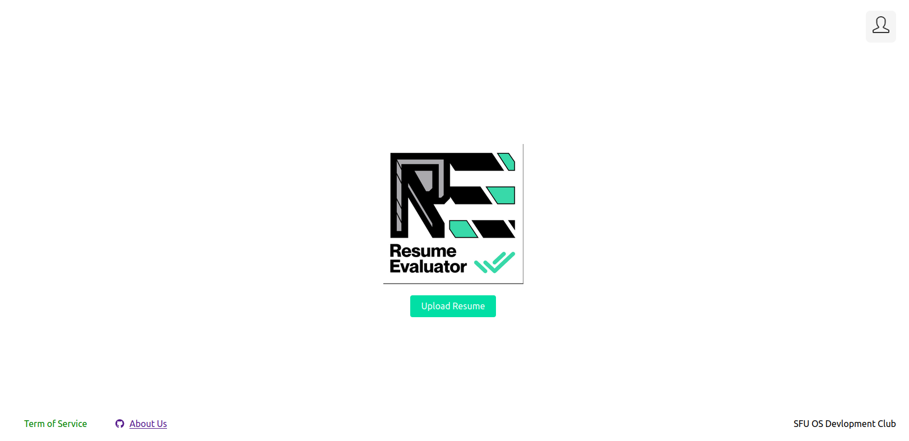

# SWE Resume Evaluator


<div>
    <a href=".">
      
    </a>
<div>

description

The demo website is live at  
https://sfuswso.github.io/Macm316/

## Credits
### `Project Lead` Jusung Park [@Pentaminum](https://github.com/Pentaminum)

## Development Setup
In the development environment, you need to turn on both the React dev server and the Express.js server. The React dev server will listen on port 4000, while Express.js will listen on port 3000.

### `Turning on React dev server`
```
npm start
```

### `Turning on Express.js server`
```
cd server
npm start
```

**Navigate to `localhost:4000/` in your browser.**  


## Production Setup
For every merge event into the main branch, the workflow will create an Express.js bundle with an optimized build of the React app.
```
cd server
npm start
```
**Navigate to `localhost:3000/` in your browser.**  

## Storybook
A Storybook server is provided to allow browsing the components used in this project.  
```
npm run storybook
```

## Testing
Run Jest and React-Testing-Library tests on React code.
```
npm run test
```

Run server-side API testing code.
```
cd server
npm run test
```